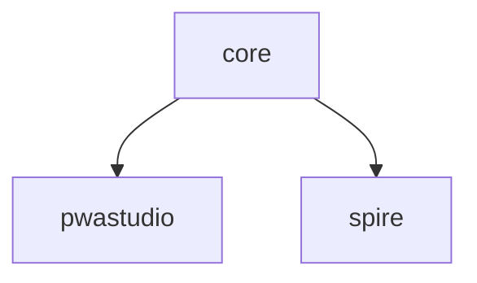

# Prettier config
[![Tests][tests-badge]][tests-url]
[![Lerna][lerna-badge]][lerna-url]


> Opinionated Prettier [shareable configs](https://prettier.io/docs/en/configuration.html#sharing-configurations).

## Rulesets

| Package | Version | Description | Documentation |
|---|---|---|---|
| **[@absolunet/prettier-config-core](packages/core)** | [](https://www.npmjs.com/package/@absolunet/prettier-config-core) | **Core rules** | [docs](https://documentation.absolunet.com/prettier-config/core) |
| [@absolunet/prettier-config-pwastudio](packages/pwastudio) | [](https://www.npmjs.com/package/@absolunet/prettier-config-pwastudio) | [PWA Studio](https://github.com/magento/pwa-studio) rules | [docs](https://documentation.absolunet.com/prettier-config/pwastudio) |
| [@absolunet/prettier-config-spire](packages/spire) | [](https://www.npmjs.com/package/@absolunet/prettier-config-spire) | [Spire](https://www.episerver.com/products/b2b-commerce-cloud) rules | [docs](https://documentation.absolunet.com/prettier-config/spire) |
|-|-|-|-|
| [@absolunet/prettier-loader](packages/loader) | [](https://www.npmjs.com/package/@absolunet/prettier-loader) | Config loader | [docs](https://documentation.absolunet.com/prettier-config/loader) |

### Dependency tree



## Install

```
$ npm install @absolunet/prettier-config-[RULESET]
```


## Usage

Add some Prettier config to your `.prettierrc.cjs`:

```js
module.exports = {
  ...require("@absolunet/prettier-config-[RULESET]")
};
```


## Related

- [@absolunet/eslint-config](https://github.com/absolunet/eslint-config) - ESLint shareable config.
- [@absolunet/stylelint-config](https://github.com/absolunet/stylelint-config) - stylelint extendable config.


# Documentation

See the [full documentation](https://documentation.absolunet.com/prettier-config) for an in-depth look.

See the [Changelog](CHANGELOG.md) to see what has changed.


## Contribute

See the [Contributing Guidelines](CONTRIBUTING.md) for ways to get started.

See the [Support Guide](SUPPORT.md) for ways to get help.

See the [Security Policy](SECURITY.md) for sharing vulnerability reports.

This project has a [Code of Conduct](CODE_OF_CONDUCT.md).
By interacting with this repository, organization, or community you agree to abide by its terms.


## License

[MIT](LICENSE) © [Absolunet](https://absolunet.com)


[tests-badge]: https://github.com/absolunet/prettier-config/workflows/tests/badge.svg?branch=production
[lerna-badge]: https://img.shields.io/badge/maintained%20with-lerna-cc00ff.svg

[tests-url]: https://github.com/absolunet/prettier-config/actions?query=workflow%3Atests+branch%3Aproduction
[lerna-url]: https://lernajs.io/
